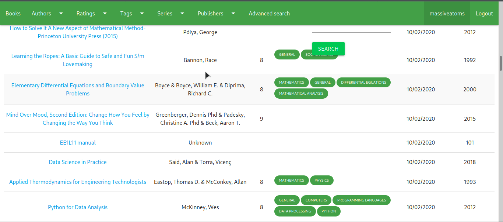
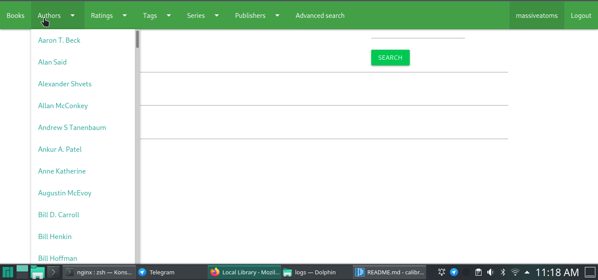
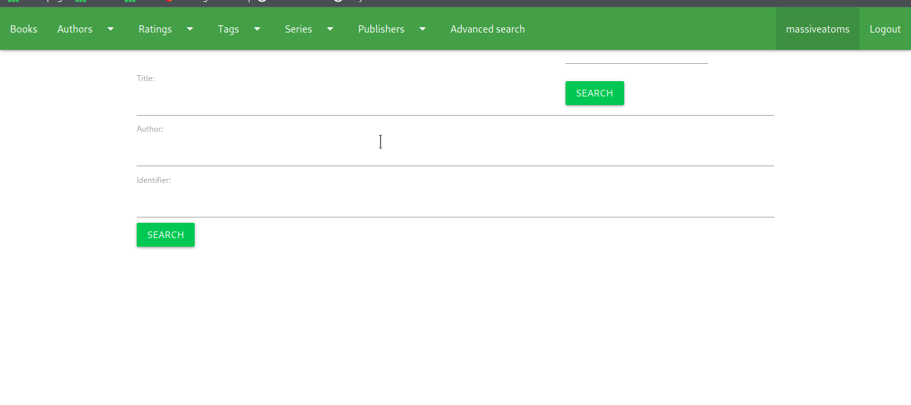

# What is CalibreWebAlternative? 
This is a web server to the popular book management application Calibre. We found that the builtin webserver was kinda shit, so we're building our own. (make this friendlier later)


# Features

-  navbar with tags, series, authors, etc
-  Search by author, identifier, title
- authentication 


# Some screenshots
Here's how the various lists look like 

Book detail

navbar

Adanced search

# requirements
Django 3.0  
Calibre 4.13 (I have not tested it with anything else atm, will be resolved later)

# how to use:
1. clone repo
2. Remove the `.bak` from `./CalibreWebCompanion/settings.json.bak`  and `db.sqlite3.bak`
3. Edit `./CalibreWebCompanion/settings.json`. Definitely change the secret key
4. Not sure if the db needs to be regenerated, but we'll see later __!!!!!!!!!!__
5. pip install -r requirements.txt
6. install gunicorn and nginx
7. move this nginx.conf to /etc/nginx
8. make whatever user nginx runs as (in this case, massiveatoms) the owner of calibredir
9. give execute permissions to parent of calibredir
10. cd to repo, run `gunicorn CalibreWebCompanion.wsgi`
11. start nginx `sudo systemctl restart nginx`


 
 
`./CalibreWebCompanion`     
run `./manage.py runserver`    

# Profiling

To do profiling, you have to create some dummy users  
Unbakify a file `./loadtesting/dummyusers.json.bak`  and fill in the credentials for the dummy users  

While django is running, open another shell and cd to `./loadtesting` and run `./bench.py`
To have a more interactive session, 
comment out 
```
run-time = 2m
headless = true
``` 
in `locust.conf`, and then run `./bench.py`
You can then go to [http://localhost:8089/](http://localhost:8089/) to see live graphs, tweak the number of users and more.


# Finished Features

- [x] Books
- [x] navbar with tags, series, authors, etc
- [x] Search
- [x] authentication 
- [x] Cache 
- [x] logging
- [x]  deploy instructions

# TODO ROADMAP
- [ ] cache with vary headers
- [ ] localisation
- [ ] Beautifying template (only works well on 720p, no other viewports)
- [ ]  Setup email functionality


 